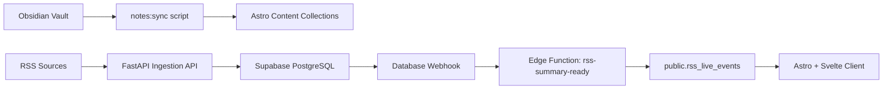

# 架构设计

## 目标

这个项目围绕三个核心目标展开：

1. 用 Astro Content Collections 托管 Obsidian 笔记内容。
2. 用 FastAPI + Supabase 实现 RSS 聚合、标签过滤、热度排序和 AI 摘要。
3. 保持前后端分离，但结构上不过度工程化，便于后续追加支付 API。

## 推荐架构



## 代码结构

```text
apps/
  web/      Astro 6 + Svelte 5 + Tailwind 4
  api/      FastAPI REST API + scheduler + AI summaries
supabase/
  migrations/
  functions/
docs/
  architecture.md
```

## 前端策略

- `apps/web` 只关心两件事：内容展示和 API 消费。
- Obsidian 内容通过 `scripts/sync-obsidian.ts` 同步到 `src/content/notes`。
- 所有非 Markdown 附件复制到 `public/notes-assets`，这样相对附件路径仍然能映射到静态资源。
- `remark-obsidian-links.mjs` 负责把 `.md` 相对链接和 `#标题` 锚点改写成站点路由。
- RSS 页面由 Svelte 组件承接交互，用 REST API 获取数据，用 Supabase Realtime 接收摘要完成事件。

## 后端策略

- FastAPI 提供标准 RESTful API：
  - `GET /api/v1/rss-sources`
  - `POST /api/v1/rss-sources`
  - `GET /api/v1/rss-entries`
  - `GET /api/v1/rss-entries/{id}`
  - `GET /api/v1/rss-tags`
  - `POST /api/v1/rss-fetch-jobs`
  - `POST /api/v1/rss-entries/{id}/summary-jobs`
- `APScheduler` 在 API 进程内运行定时抓取，避免单独引入消息队列和 worker。
- RSS 解析、热度计算、AI 摘要都在 `app/services/rss_service.py` 里串起来。
- 管理接口默认支持两种保护方式：
  - Supabase Auth JWT
  - `X-Admin-Token` 作为本地或服务器侧兜底

## Supabase 设计

### 核心表

- `public.rss_sources`：RSS 源配置、拉取间隔、ETag、最后一次状态
- `public.rss_entries`：聚合后的条目、标签、热度分数、摘要状态
- `public.rss_live_events`：前端 Realtime 订阅的轻量事件表

### UNLOGGED 缓存表

- `cache.api_response_cache`
- `cache.hot_snapshots`

这两张表用来替代一部分 Redis 的“短时缓存”职责，优点是：

- 结构简单，直接和业务 SQL 共置
- 查询命中快，适合首页热点流和标签页缓存
- crash 后自动丢失也没关系，因为可以重新计算

注意：UNLOGGED 表不适合存放核心业务数据，所以这里只缓存可重建的派生结果。

## Edge Function 链路

`rss-summary-ready` 的职责非常明确：

1. 接收数据库 webhook。
2. 判断摘要是不是刚完成。
3. 将精简后的展示 payload 写入 `public.rss_live_events`。

这样做的好处是：

- WebSocket/Realtime 只处理轻量事件，不背业务逻辑。
- AI 摘要可以在后端慢慢跑，前端收到更新时只需要补一块内容。
- 将来如果要为移动端、邮件、企业微信等终端生成不同 payload，也可以继续在 Edge Function 里扩展。

## 部署建议

### 前端

- 代码托管在 GitHub。
- Astro 前端连接 Cloudflare Pages 或 Cloudflare Workers。
- DNS 统一托管在 Cloudflare。
- 如果走 Cloudflare Workers 部署，建议开启 `nodejs_compat`，因为 Svelte SSR 在构建期会提示 `node:async_hooks` 兼容警告。

### 后端

- FastAPI 用 `apps/api/Dockerfile` 打包。
- 部署到你的云服务器 Docker 环境。
- 环境变量中填 Supabase 数据库连接串与 AI 服务配置。

### Supabase

1. 执行 `supabase/migrations`。
2. 部署 `rss-summary-ready` Edge Function。
3. 在 Supabase Dashboard 里创建 Database Webhook：
   - 表：`public.rss_entries`
   - 事件：`UPDATE`
   - 过滤条件：`summary_status=eq.completed`
   - URL：`https://<project-ref>.supabase.co/functions/v1/rss-summary-ready`

## 为什么这个方案适合你

- 内容与数据彻底分层：Obsidian 继续写作，FastAPI 继续聚合，Supabase 继续承载数据和鉴权。
- 没有提前引入 Celery、Redis、Kafka 这类额外基础设施，足够轻，但扩展点都保留了。
- 后续要加支付 API，只需要在 `apps/api` 下继续扩展路由和服务层，不会反向污染前端内容系统。
