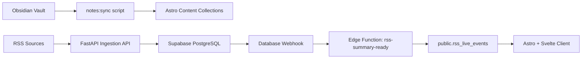

# 架构设计

## 目标

这个项目围绕三个核心目标展开：

1. 用 Astro Content Collections 托管 Obsidian 笔记内容。
2. 用 FastAPI + Supabase 实现 RSS 聚合、热度排序、分类筛选、AI 摘要和 AI 标签。
3. 保持前后端分离，但结构上不过度工程化，便于后续追加支付 API。

## 推荐架构



## 代码结构

```text
apps/
  web/      Astro 6 + Svelte 5 + Tailwind 4
  api/      FastAPI REST API + scheduler + AI summaries
supabase/
  migrations/
  functions/
docs/
  architecture.md
```

## 前端策略

- `apps/web` 只关心两件事：内容展示和 API 消费。
- Obsidian 内容通过 `scripts/sync-obsidian.ts` 同步到 `src/content/notes`。
- 所有非 Markdown 附件复制到 `public/notes-assets`，这样相对附件路径仍然能映射到静态资源。
- `remark-obsidian-links.mjs` 负责把 `.md` 相对链接和 `#标题` 锚点改写成站点路由。
- RSS 页面由一个 Svelte 组件承接交互，统一处理类目切换、源列表、标签筛选、订阅收藏和 Realtime 更新。
- 邮箱登录回跳统一走 `/auth/confirm`，避免直接回跳业务页时 magic link/code 交换不稳定。

## 后端策略

- FastAPI 提供标准 RESTful API：
  - `GET /api/v1/rss-sources`
  - `POST /api/v1/rss-sources`
  - `GET /api/v1/rss-entries`
  - `GET /api/v1/rss-entries/{id}`
  - `GET /api/v1/rss-tags`
  - `POST /api/v1/rss-fetch-jobs`
  - `POST /api/v1/rss-entries/{id}/summary-jobs`
- `APScheduler` 在 API 进程内运行定时抓取，避免单独引入消息队列和 worker。
- 调度器在服务启动后会立即执行一次抓取，然后再按间隔继续运行，减少部署后长时间停留在旧数据的情况。
- RSS 解析、热度计算、AI 摘要与 AI 标签都集中在 `app/services/rss_service.py` 和 `app/services/summary_service.py`。
- 管理接口默认支持两种保护方式：
  - Supabase Auth JWT
  - `X-Admin-Token` 作为本地或服务器侧兜底

## Supabase 设计

### 核心表

- `public.rss_sources`：RSS 源配置、类目、拉取间隔、ETag、最后一次状态
- `public.rss_entries`：聚合后的条目、AI 标签、热度分数、摘要状态
- `public.rss_live_events`：前端 Realtime 订阅的轻量事件表
- `public.user_source_favorites`：用户收藏的订阅源，开启 RLS 后只允许用户访问自己的记录

### UNLOGGED 缓存表

- `cache.api_response_cache`
- `cache.hot_snapshots`

这两张表用来替代一部分 Redis 的短时缓存职责，优点是：

- 结构简单，直接和业务 SQL 共置
- 查询命中快，适合首页热点流和筛选结果缓存
- crash 后自动丢失也没关系，因为可以重新计算

注意：UNLOGGED 表不适合存放核心业务数据，所以这里只缓存可重建的派生结果。

### 鉴权与权限边界

- 前端登录统一使用 Supabase Auth，当前支持两种轻量登录方式：
  - GitHub OAuth
  - 邮箱 Magic Link
- 收藏功能不走额外后端中转，前端直接通过 Supabase 客户端访问 `public.user_source_favorites`。
- 这张收藏表由 RLS 保护，策略限制为“只能读写自己的收藏”。
- 数据库触发器同时限制：
  - 站点总注册用户最多 20 个
  - 单个用户最多收藏 50 个 RSS 源
- Supabase 自带邮箱服务有速率限制，正式环境如果要稳定支持多人邮箱登录，建议切到自定义 SMTP。

### RSS 保留与标签策略

- API 查询层默认只返回最近 30 天内的 RSS 条目。
- 抓取任务每次完成后会顺手裁剪超过 30 天的旧条目，避免数据越积越多。
- `pg_cron` 继续每天执行一次兜底清理，同时定时清掉过期缓存。
- 条目标签不再直接复用源标签，而是由 AI 从正文中提炼，单条最多保留 5 个。
- 标签聚合同样只统计最近 30 天内的数据，并且只返回出现次数大于等于 5 的标签，避免前端筛选过碎。

## Edge Function 链路

`rss-summary-ready` 的职责非常明确：

1. 接收数据库 webhook。
2. 判断摘要是不是刚完成。
3. 将精简后的展示 payload 写入 `public.rss_live_events`。

这样做的好处是：

- WebSocket/Realtime 只处理轻量事件，不背业务逻辑。
- AI 摘要可以在后端慢慢跑，前端收到更新时只需要补一块内容。
- 将来如果要为移动端、邮件、企业微信等终端生成不同 payload，也可以继续在 Edge Function 里扩展。

## 部署建议

### 前端

- 代码托管在 GitHub。
- Astro 前端部署到 Cloudflare Workers。
- DNS 统一托管在 Cloudflare。
- 建议开启 `nodejs_compat`，因为 Svelte SSR 在 Cloudflare 上会用到 Node 兼容能力。

### 后端

- FastAPI 用 `apps/api/Dockerfile` 打包。
- 部署到你的云服务器 Docker 环境。
- 环境变量中填 Supabase 数据库连接串与 AI 服务配置。
- 如果运行环境不保证 IPv6，优先使用 Supabase `Connect` 页面里的 session pooler 连接串，而不是 `db.<project-ref>.supabase.co:5432` 的直连地址。

### Supabase

1. 执行 `supabase/migrations`。
2. 部署 `rss-summary-ready` Edge Function。
3. 在 Supabase Dashboard 里创建 Database Webhook：
   - 表：`public.rss_entries`
   - 事件：`UPDATE`
   - 过滤条件：`summary_status=eq.completed`
   - URL：`https://<project-ref>.supabase.co/functions/v1/rss-summary-ready`

## 为什么这个方案适合你

- 内容与数据彻底分层：Obsidian 继续写作，FastAPI 继续聚合，Supabase 继续承载数据和鉴权。
- 没有提前引入 Celery、Redis、Kafka 这类额外基础设施，足够轻，但扩展点都保留了。
- 后续要加支付 API，只需要在 `apps/api` 下继续扩展路由和服务层，不会反向污染前端内容系统。
